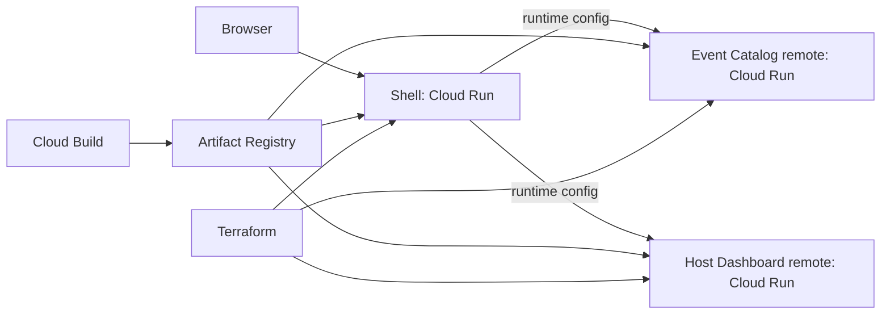

# Architecture

## Intent

The POC demonstrates independent frontend ownership without splitting a simple product into unnecessary backend services. The shell owns the shared journey and navigation; each domain team owns its screen, release cadence, and Module Federation entry point.

## Boundaries

| Application | Owns | Does not own |
| --- | --- | --- |
| Shell | App frame, navigation, remote orchestration, runtime configuration | Domain UI and domain data |
| Event Catalog | Event discovery UI and catalog state | Host-management UI |
| Host Dashboard | Host-management UI and state | Public event discovery |

The shell resolves remotes from `window.__EVENTHUB_CONFIG__`. This prevents rebuilding the shell just to change a remote origin. A failed remote is visible to the user as an explicit unavailable state; there is no hidden local fallback.

## GCP model

Each frontend is an independently versioned static bundle served by its own Cloud Run service. Cloud Build creates immutable Artifact Registry images. Terraform declares the services and wires the shell's `EVENTS_REMOTE_URL` and `DASHBOARD_REMOTE_URL` environment variables to the deployed remote services. For production, place the services behind a global HTTPS load balancer and Cloud CDN, restrict Cloud Run ingress to the load balancer, and replace public invoker access with IAP or an identity-aware gateway.

The Terraform configuration keeps public invocation enabled only because this is a browser-hosted POC; it is marked in code as the security boundary to change before production.

## Release contract

1. A remote publishes `remoteEntry.js` and compatible exposed module `./App`.
2. The shell loads the remote by its configured URL and shares React as a singleton.
3. A remote deployment is backward compatible with the currently deployed shell.
4. The shell can roll forward independently; remote URLs change only via Cloud Run configuration.

This contract is intentionally small. Cross-application state, business events, and shared packages are excluded until a real product need establishes their ownership. The POC deliberately avoids a shared UI package: the current duplication is too small to justify a cross-team ownership boundary.
