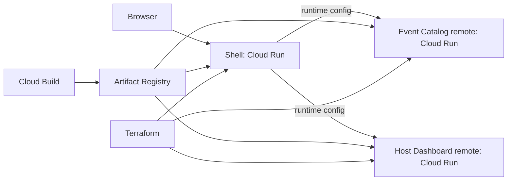

# Architecture

## Intent

The POC demonstrates independent frontend ownership without splitting a simple product into unnecessary backend services. The shell owns the shared journey and navigation; each domain team owns its screen, release cadence, and Module Federation entry point.

## Boundaries

| Application | Owns | Does not own |
| --- | --- | --- |
| Shell | App frame, navigation, remote orchestration, runtime configuration | Domain UI and domain data |
| Event Catalog | Event discovery UI and catalog state | Host-management UI |
| Host Dashboard | Host-management UI and state | Public event discovery |

The shell resolves a generic `remotes` manifest from `window.__EVENTHUB_CONFIG__`. Each entry carries `id`, `navigationLabel`, `scope`, `module`, and `url`. Navigation and the loaded view are rendered from that manifest, so adding a remote is a configuration change rather than a new shell code path. Production receives this manifest from `config.js`; local development uses its explicit localhost manifest. A missing production URL is an explicit configuration error, never a hidden localhost fallback. A failed remote is visible to the user as an unavailable state.

`events` and `host-dashboard` are versioned npm workspace packages with their own dependency declarations, typecheck/build/verification commands, Dockerfiles, Module Federation containers, and Cloud Build definitions. They do not declare dependencies on one another or on the shell. The root workspace coordinates local development only; it is not an import boundary between applications.

## GCP model

Each frontend is an independently versioned static bundle served by its own Cloud Run service. The three Cloud Build definitions each produce one immutable Artifact Registry image, allowing a remote image to be built and released without rebuilding either other application. Terraform declares the services and wires the shell's `EVENTS_REMOTE_URL` and `DASHBOARD_REMOTE_URL` environment variables to the deployed remote services. For production, place the services behind a global HTTPS load balancer and Cloud CDN, restrict Cloud Run ingress to the load balancer, and replace public invoker access with IAP or an identity-aware gateway.

The Terraform configuration keeps public invocation enabled only because this is a browser-hosted POC; it is marked in code as the security boundary to change before production.

## Release contract

1. A remote publishes `remoteEntry.js` and compatible exposed module `./App`.
2. The shell loads the remote by its configured URL and shares React as a singleton.
3. A remote deployment is backward compatible with the currently deployed shell, including the required React `^18.3.1` singleton contract.
4. The shell can roll forward independently; remote URLs change only via Cloud Run configuration.

This contract is intentionally small. Cross-application state, business events, and shared packages are excluded until a real product need establishes their ownership. The POC deliberately avoids a shared UI package: the current duplication is too small to justify a cross-team ownership boundary.

## Independence check

`npm run verify:independence` independently builds both remotes, confirms each emitted `remoteEntry.js` exposes its required `./App` contract, and asserts that the package, Docker, webpack, and Cloud Build boundaries do not point at the other remote. This is a repeatable repository-level guard against turning either remote into an internal shell import.

For deployment-level evidence, release a changed `events` image with `infra/cloudbuild/events.yaml` and update only the `events_image` Terraform variable; then do the symmetric check with `host-dashboard.yaml` and `dashboard_image`. The untouched Cloud Run revisions remain unchanged, while the existing shell reads the new remote URL through its runtime configuration. A remote must preserve the release contract above to be independently deployable.
